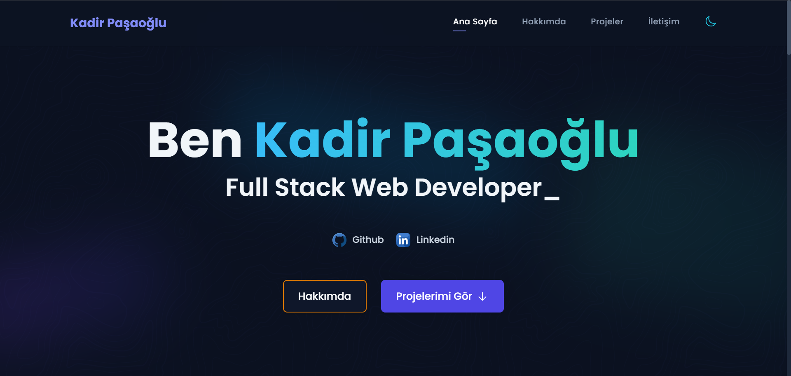

# Kadir Paşaoğlu - Kişisel Portföy

<div align="center">
  
</div>

## 🚀 Proje Hakkında

Bu portföy websitesi, yazılım geliştirme yolculuğumu ve projelerimi sergilemek için Vue.js ve modern web teknolojileri kullanılarak geliştirilmiştir. Responsive tasarımı, dark/light tema desteği ve modern UI/UX özellikleriyle profesyonel bir deneyim sunmayı hedeflemektedir.

## 🛠️ Kullanılan Teknolojiler

- Vue.js 3
- Vite
- Tailwind CSS
- JavaScript/TypeScript
- Git

## ✨ Özellikler

- 📱 Responsive Tasarım
- 🌓 Dark/Light Tema Desteği
- 🎯 Dinamik İçerik Yönetimi
- 📂 Proje Portföyü
- 📊 Yetenekler Bölümü
- 📝 Deneyim ve Eğitim Bilgileri
- 📫 İletişim Formu

## 🔗 Canlı Demo

[https://kadirn7.github.io/MyPortfolio-v1/](https://kadirn7.github.io/MyPortfolio-v1/)

## 💻 Kurulum

1. Projeyi klonlayın:
   ```bash
   git clone https://github.com/kadirn7/MyPortfolio-v1.git
   ```

2. Proje dizinine gidin:
   ```bash
   cd MyPortfolio-v1
   ```

3. Gerekli bağımlılıkları yükleyin:
   ```bash
   npm install
   # veya
   yarn install
   ```

4. Geliştirme sunucusunu başlatın:
   ```bash
   npm run dev
   # veya
   yarn dev
   ```

5. Projeyi production için derleyin:
   ```bash
   npm run build
   # veya
   yarn build
   ```

Tarayıcınızda `http://localhost:5173` adresine giderek projeyi görüntüleyebilirsiniz.

## 📁 Proje Yapısı

```
MyPortfolio-v1/
├── public/
│   └── images/
├── src/
│   ├── assets/
│   ├── components/
│   ├── composables/
│   ├── data/
│   ├── layouts/
│   └── sections/
└── README.md
```

## 🤝 İletişim

- GitHub: [@kadirn7](https://github.com/kadirn7)
- LinkedIn: [Kadir Paşaoğlu](https://www.linkedin.com/in/kadir-pasaoglu/)
- Email: kadirneidik398@gmail.com

## 📄 Lisans

Bu proje [MIT](LICENSE) lisansı altında lisanslanmıştır.

---

⭐️ Bu projeyi beğendiyseniz yıldız vermeyi unutmayın!
